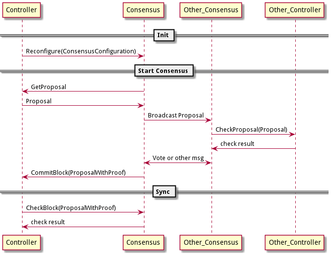

# CITA2.0 架构

## 1. 区块链最核心的东西
- 核心数据结构。交易和块的数据结构。
- 核心流程。出块/查询/节点间同步等流程。
- 功能性组件。比如网络/共识算法/存储/虚拟机等。

## 2. 架构设计
cita2.0 通过微服务把区块链拆分成6个部分：  
    Controller ， Network ， Consensus ， Storage ， Executor ， KMS

- Controller  
    核心数据结构和核心流程都集中在 Controller 微服务中。

- KMS  
    CITA2.0 将密码学算法单独抽离出一个 KMS 微服务，形式上类似于一个软件加密机。通过 KMS 微服务可以灵活替换加密算法。  
    （从原有的直接函数调用改为 rpc 调用可能会导致性能瓶颈。解决方法是可以部署多个 KMS 微服务的实例来分担压力。）

- 系统配置  
    像共识节点列表，系统管理员账户这一类会影响链本身行为的数据称为系统配置。CITA2.0 通过内置的合约管理系统配置。

- 共识算法的确定性  
    配置参数—— Block Delay Number 决定了，区块共识后，再过几个块会最终确认。

- Executor  
    Executor 中包含：智能合约 VM、历史状态的存储和管理、交易执行及过程中的 log，交易执行后的 receipt，还有快照等更复杂的功能。Executor 很复杂，它的代码量占整体代码的一半。

- Consensus  
    主要提供让提案在多个共识参与方之间达成一致的功能。

### 3. 共识

