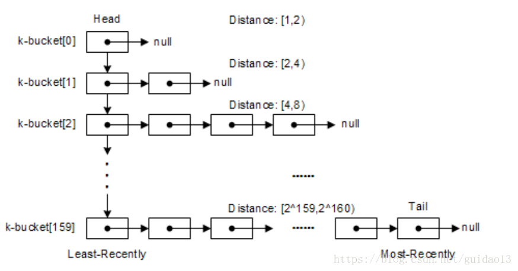

# DHT（分布式哈希表技术）

## 1. 简介
DHT 是一种分布式存储方法。在不需要服务器的情况下，每个客户端负责一个小范围的路由，并负责存储一小部分数据，从而实现整个 DHT 网络的寻址和存储。

## 2. Kademlia
### 2.1 bucket
- kad 网络中的使用 SHA1 来计算节点 id
    > Ethereum 使用 sha3，也是 256 位哈希空间， 32 字节。
    > IPFS 中都使用 SHA256 来计算 Node ID，长度和 Ethereum 相同。
- 节点之间通过异或 id 计算距离，异或值越小，距离越近。
- 节点会根据距离维护 k-bucket 组，k-bucket[1] 是距离为1的节点，k-bucket[2] 是距离为2的...
- k-bucket[k] 中最多保存 k 个节点，实际 k 通常 =20。
- k-bucket 的高度必须是偶数，BitTorrent 为8，Ethereum 为16。

k-bucket表结构如下图所示：

k-bucket 的更新：
- 每层 k-bucket 中，会把在线时间长的节点放在前面的位置。
- 当一层 k-bucket 中的节点数量满了后，有新的节点加入就会使用淘汰算法。
    > 淘汰算法：ping 头部节点，如果成功，就抛弃新节点；如果失败，丢弃头部节点，就把新的节点放在尾部。  
    > 淘汰算法可以防御 DOS 攻击，因为只有当老节点失效后，Kad 才会更新 K 桶的信息，这就避免了通过新节点的加入来泛洪路由信息。
- 为了防止 K 桶老化，在一定时间之内无更新操作的 K 桶，会从 K 桶中随机选择一些节点执行 Ping 操作。

### 2.2 4个指令
- Ping：用于探测一个节点是否在线
- Store：通知一个节点存储一个 kv 对
- FindNode：向一个节点发送想要连接的节点的 id，让该节点返回距离 id 最近的 alpha 个节点
- FindValue：类似于FindNode，但是只要返回bucket中一个节点的信息

这4个指令的接收者要防止伪造 id  
如何防止伪造 id：
> id 最好由 ip 地址 hash 获得，对其他节点发送请求时需要附带 id 和 ip，如果 ip 造假，tcp 连接就会失败。

### 2.3 路由查询
查询的核心思想是：逐步迭代，递近查找。其过程如下：
> 假设节点 m 想要找到节点 x、和 x 的距离是 d。  
> 1. 节点 m 使用 FIND_NODE 操作：找到距离 x 最近的 alpha 个节点。  
> 2. 然后这 alpha 个节点再进行 FIND_NODE 操作，直到找到 x。

> 每进行一次 FIND_NODE 操作，就会离 x 越近。  
> 在 BitTorrent 和 Ethereum 中设定 alpha = 3。

### 2.4 新节点加入
1. 新节点必须有网络中的一个节点才能加入网络，首先将已知的节点加入到 k-bucket 中。
2. 向已知的节点发送 FIND_NODE 指令，查询的目的节点是自己本身。
3. 将返回的节点信息添加到自己的 k-bucket 中，通过这种方式可以快速地找到很多距离自己近的节点。

### 2.5 节点离线
节点离线会通知路由表中的节点将自己剔除。

### 2.6 用 kad 网络存储数据
建立对象与节点的映射，一般有两种方法：
> 1. 维护全局<节点，数据>映射表  
> 2. 根据数据特征，通过数学运算得到目标节点

- 方法1需要维护庞大的全局映射表，且其很明显会成为系统瓶颈。

- 方法2：将数据哈希，根据该哈希找到网络中与其最接近的​ t 个节点，由这些节点存储数据。

使用方法2会存在下面两个问题：
- 如果存储数据的节点全部离线，那么数据便不可达；
- 如果网络新加入节点，​且它距离数据的哈希更接近，对象也需要进行一次迁移，因为下次去查找的时候，会直接定位到这个新节点​，如果数据不迁移，那虽然数据存在，但也是不可达。

解决上面的问题有以下两种思路：
- Pull：如果新增一个节点​，且​距离某数据更为接近。此时某节点向新节点请求数据时，新节点的 k-bucket 中大概率保存了实际保存了该数据的节点，新节点向实际保存了数据的节点拷贝一份数据，再返回数据给请求的节点。
- Push：如果新增一个节点​，且​距离某数据更为接近，一旦数据​所在的节点探测到这个新节点​的存在，会主动地将​数据推至新节点​，这也可以保证下次访问​时无需中转而直接获取到数据。

对比两种方案:
- 方案1不能解决节点都不在线的不可访问问题。
- 方案2：每过1个小时，查看这个时间段内是否有距离自己很近的节点加入到网络，将文件传输给新加入的距离近的几个节点。
    > 方案2也并非完美：一旦有新增节点可能就会带来大量的数据拷贝，消耗大量资源。

[参考文档1](https://www.jianshu.com/p/eba4673b0d9a)  
[参考文档2](https://zhuanlan.zhihu.com/p/38425656)
