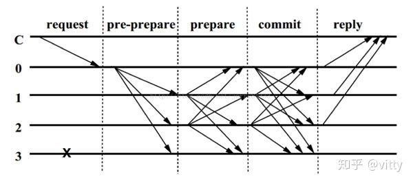

# PBFT
[参考文档1](https://blog.csdn.net/wuzhengfei1112/article/details/105890053/)  
[参考文档2](https://zhuanlan.zhihu.com/p/93023831)

## 1. 简介
PBFT一般用于联盟链场景中，它是共识节点较少的情况下BFT的一种解决方案，PBFT 中的共识节点不宜超过100个，否则效率极低。

## 2. 容错率
假如节点总数为n，故障节点数为f，当 n >= 3f+1 时才能达成拜占庭协定。

## 3. PBFT 中的密码学
PBFT算法采用密码学相关的技术（RSA签名算法、消息验证编码MAC和哈希等）确保消息传递过程中无法被篡改和破坏。

## 4. 角色设计
a. 客户端（c）：向 primary 发起请求的客户端节点；会触发 view change。  
b. 主节点（primary）：将收到的请求排序、广播。  
c. 从节点/备份节点（replica，也称副本节点）：接收广播消息，验证请求合法性，投票。当主节点不能正常为客户端提供服务时，会触发 view change 更换协议，将从节点选举为主节点。  
d. 视图（view）：一个 view 中存在一个主节点和多个副本节点，它描述了一个多副本系统的当前状态。另外，节点是在同一个 view 上对数据达成共识，不能跨域 view。  
e. 每个副本节点的状态都包含了服务的整体状态，副本节点上的消息日志(message log)包含了该副本节点接受(accepted)的消息，并且使用一个整数表示副本节点的当前视图编号（记作i）。

## 5. 三阶段
PBFT算法一致性的确保主要分为这三个阶段：预准备（pre-prepare）、准备(prepare)和确认(commit)。流程如下图所示（图中3为故障节点）：  

- Request：客户端C 发送请求到主节点0；
- Pre-Prepare：主节点0 收到 C 的请求后进行广播，扩散至123；
- Prepare：从节点123 收到后记录并再次广播，1->023，2->013，这一步是防止主节点给从节点发送不同的请求。
- Commit：节点0123 若收到超过 2F 的相同请求，则进入Commit阶段，广播Commit请求；
- Reply：若节点0123 其中有一个收到超过一定数量（2F+1）的相同请求，则对C进行反馈；

## 6. 优化
RSA 比 MAC 复杂，因此，RSA 仅用于将备份副本升级为主副本。所有其他消息均使用 SHA256 等 MAC 进行身份验证。
