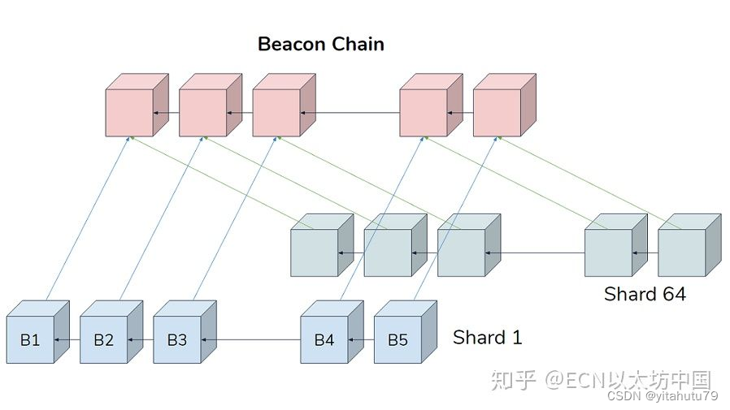

# 以太坊2.0

[参考文档1 2022-8-8](http://news.sohu.com/a/575187511_100167169)
[参考文档2 2022-5-10](https://blog.csdn.net/qq_40713201/article/details/124694816)

## 1. 四阶段
- 边境（Frontier，2015年7月）：以太坊网络第一次上线，开发者可以在上面挖以太币，并开始开发dApp和各种工具。
- 家园（Homestead，2016年3月）：以太坊发布了第一个正式版本，对协议进行了优化，为之后的升级奠定了基础，并加快了交易速度。
- 大都会（Metropolis，2017年10月）：这个阶段分两次上线，分别是拜占（Byzantium，2017年10月）和君士坦丁堡（Constantinople，2019年1月），让以太坊变得更轻量、更快速、更安全。
- 宁静（Serenity，时间待定）

## 2. 宁静阶段
这个阶段将会为我们带来期待已久的 PoS 共识，使用 Casper 共识算法。主要是为了增强以太坊的可扩展性，交易吞吐量和安全性。它分为三个阶段：
- 信标链（Beacon Chain）：它能够管理验证者、协调分片链
- 分片链（Shard Chains）：通过创建称为“分片”的新链来减少网络拥塞
- eWASM ：一种新的改进的虚拟机。为分片链增加执行环境（EE），届时各分片可以有各异的执行模式（UTXO、Account-basde，等等）  

### 2.1 信标链

### 2.2 分片链

分片阶段会添加64个分片链，每个分片512KB的区块？，每个分片链每 12s 出一个块，这些区块只是包含数据，分片内部没有执行交易，他们的目的是提供更多的数据空间，以允许 rollup 使用这些空间。现阶段，如果都使用 rollup 的话，可以扩容到每秒4000-5000笔交易，如果再加上分片就能提升20-50倍，rollup 有可能达到每秒10万笔交易

随机分配 (shuffling) 验证者，每个分片区块都有一个委员会，其中的验证者都经由随机挑选，只处理和验证自己所在分片链上的交易。

此外，错误性证明（fraud proofs）、数据托管证明 (custody proofs) 和数据可用性检查 (data availability checks) 都是确保安全的重要因素，不过需要单独的讲解才能说清楚。

在这个阶段早期，PoS 和 PoW 是同时存在的，但是由于 PoW 难度计算公式中的难度炸弹参数的存在，PoW 挖矿会越来越难，预计将会在阶段1.5取消 PoW 1.5？

以太坊2.0目的：提高效率，降低交易费，更新密码学技术来对抗量子计算，让个人也能参与分片处理

会将 RLP 换成 SSZ

账户长度会从20字节增长到32字节，verkle+无状态客户端

柏林、伦敦硬分叉  分叉合并 删除pow

eip-1559
