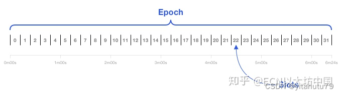

# 以太坊2.0共识

## 1. 时隙 (slots) 和时段 (epochs)

每个 slot 为12秒，会产生一个新的区块，每个 epoch 由32个 slots 组成，即6.4分钟。。

## 2. 共识过程
- 每个 epoch 会随机挑选最少 128 位验证者组成一条链上的委员会。每个 slot，委员会随机挑选一个活跃的验证者，成为区块提议者。信标链上管理着验证者的名单，以及分片验证者任务。
- 区块提议者收集交易、组成区块，如果他提议的区块得到2/3以上的验证者投票（投票通过验证者质押的金额进行加权）赞成，则达成共识，他就会得到奖励，并将分片区块头和信标区块体连接。
- 这些投票会记录在信标链上。
- 验证者之间也会互相监督，通过举报其他验证者自相矛盾的投票或提议多个区块的行为，从而获得奖励。作恶的验证者会受到处罚，当抵押的 ETH 少于16时，会被从验证者列表中删除。
- 验证者可以获得部分的网络交易费
- 合法链是投票最多的链，而不是最长的
- 每个 epoch 会最终确认这期间的区块
