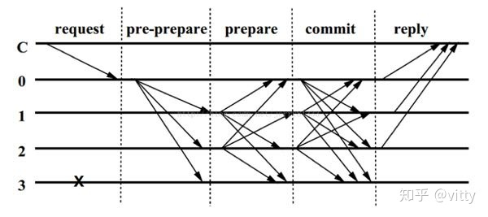
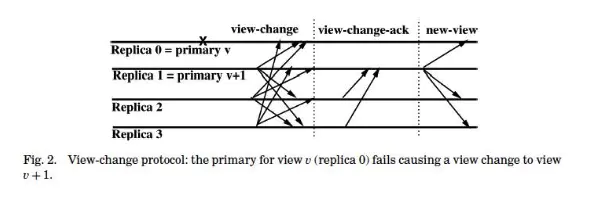

# PBFT

## 1. 简介
PBFT 一般用于联盟链场景中，它是共识节点较少的情况下BFT的一种解决方案，PBFT 中的共识节点不宜超过100个，否则效率极低。 
- PBFT 算法的计算效率依赖于参与协议的节点数量，由于每个副本节点都需要和其它节点进行 P2P 的共识同步，因此随着节点的增多，性能会下降的很快。 

PBFT 算法假设的环境又比 Raft 算法更加的’恶劣‘，Raft 算法只支持容错故障节点，而 PBFT 算法除了需要支持容错故障节点之外，还需要容忍作恶节点。

## 2. 三阶段
PBFT算法一致性的确保主要分为这三个阶段：预准备（pre-prepare）、准备(prepare)和确认(commit)。流程如下图所示（图中3为故障节点）：  

三阶段消息中都会包含数字签名，以及消息类型，下文中会省略。  

1. Pre-prepare 消息由主节点发出，包含：
   - v：当前 view（版本）
   - n：请求的序号（主节点分配）
   - d：请求的摘要
   - m：请求本身

2. 从节点收到 Pre-prepare 消息后，发送 Prepare 消息（v，n，d）。

3. 从节点收到 2f+1 个相同的 Prepare 消息后，进入 Parpared 状态，发送 Commit 消息（v，n，d）。

4. Reply：从节点收到 2f+1 个相同的 Commit 消息后，进入 Commit-Local 状态，执行请求，并对客户端反馈，客户端收到 f+1 个相同请求，则结束整个过程。

## 3. 为什么需要三阶段  
https://lessisbetter.site/2020/03/15/why-pbft-needs-3-phase-message/  
如果拜占庭节点针对性的给一部分从节点发送正确的 Prepare 信息，一部分发送错误的信息   
那么会有一部分从节点进入 Prepared 状态，一部分则不会  
如果没有 Commit 阶段，这小部分则会直接执行 m，但是这时候只有小部分达成了共识，可能没有超过 2/3.

## 4. 容错率
节点总数是 n，其中作恶节点有 f，那么剩下的正确节点为 n-f，节点不能等到收集全部 n 个响应再进入下一个阶段，这样会导致不能达成最终共识。所以，节点需要对 n-f 个消息做出决定，但是这 n-f 个消息有可能有 f 个是由作恶节点冒充的，那么正确的消息就是 n-f-f 个，所以 n 最少是 3f+1 个。

## 5. 垃圾清理
节点每执行 K 条请求后向全网发起广播，如果超过 2f+1 的节点返回这 k 条请求也执行完毕了的消息，那就可以删除这 K 条的信息了。 此时 k 为一个 checkpoint。
实际上当节点向全网发出垃圾清理共识后，其他节点可能没有执行完这 K 条请求，所以节点不会立即得到响应，它还要继续自己的事情。我们可以设置一个变量 L，L 是 k 的倍数，当距离上一次垃圾清理 L 时，节点需要垃圾清理后才能继续共识。

## 6. view change
checkpoint 就是当前节点处理的最新请求序号。stable checkpoint（稳定检查点）就是大部分节点已经共识完成的最大请求序号。  
发生 view change 时，view 会自增，主节点通过 v % n 计算得来。

### 触发 view change 的4个条件：  
1. 正常三阶段定时器超时
2. View Changes 阶段定时器超时
3. 节点收到的 view change 消息达到 f+1 个
4. new-view 消息不合法

### 视图切换过程中有3个消息： 
view-change 消息、view-change-ack 消息和 new-view 消息

### view-change 消息包含下列字段：
- h：从节点最新的 checkpoint 序号
- C：从节点 h 之后的（非稳定）checkpoint
- P
> P 是大于 h 已经 Prepared 消息的集合。消息既然已经 Prepared，说明**至少 2f+1 的节点认可<v, n, d>**，只差 commit 就可以完成一致性确认。P 中包含：主节点发送的一个 Pre-prepare 消息和 2f+1 个 Prepare 消息。

### view-change-ack 消息
从节点收到 2f+1 个 view-change 消息后，验证，并将结果（view-change-ack）发送给新的主节点。

### new-view 消息
新的主节点收到 2f+1 个view-change-ack（包含自己的）消息后，选出一个最大的 checkpoint h，主节点会从 h 和 h+L 之间，一次对请求进行 Pre-prepare，如果这个请求在上一个 view 中达到 Prepared，就直接 commit。

new-view 消息包含下列字段：
- view：当前新视图的编号
- V：有效的 view-change 消息集合，用于证明，主节点已经获得大多数节点的认可。
- X：需要执行的请求的集合
- α：主节点对 new-view 消息的数字签名
