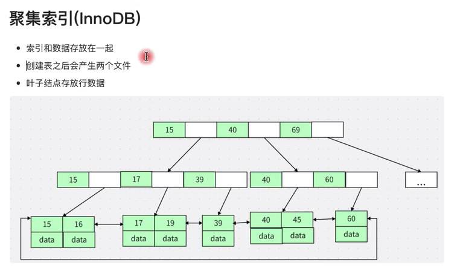
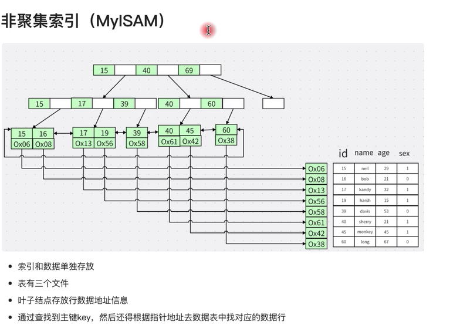
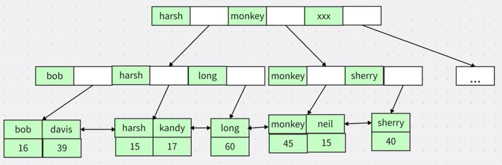

# 聚集索引和非聚集索引

## 区别
- mysql 的索引类型跟存储引擎是相关的，innodb 存储引攀数据文件跟索引文件全部放在 idb 文件中，而 myisam 的数据文件放在 myd 文件中，索引放在 myi 文件中。  
- 其实区分聚集索引和非聚集索引非常简单，只要判断数据跟索引是否存储在一起就可以了。在一起：聚集索引  
- innodb 存储引擎在进行数据插入的时候，数据必须要跟索引放在一起，如果有主键就使用主键，没有主键就使用唯一键，没有唯一键就使用6字节的自增 rowid，因此跟数据绑定在一起的就是聚集索引，而为了避免数据冗余存储，其他的索引的叶子节点中存储的都是聚集索引的 key 值，因此 innodb 中既有聚集索引也有非聚集索引，而 myisam 中只有非聚集索引。  
- 聚集索引是以物理磁盘顺序来存储

