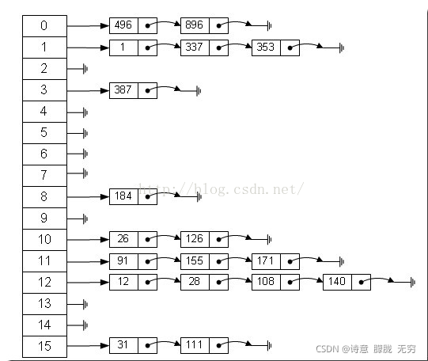

# 数据结构

- 队列：先进先出
- 列表：与数组类似
- 栈
- 链表：单链表、双链表

## 1. 哈希表
hash表把key通过hash函数转化成一个特定的整数，然后与数组的长度取余，取余结果（hash值）当做该数组的下标，然后将value存储在该下标中。  
但是hash会冲突，有两种解决方法：
- 1. 拉链法

上图中，显然，左边是数组，右边是链表

- 2. 开放定制法
使用数组中的空位解决碰撞冲突

## 2. 二叉树
### 二叉搜索树(二叉排序树、二叉查找树)
- 二叉搜索树：left.value < root.value < right.value  
- 删除二叉搜索树的节点，如果这个节点有两个child节点，则把有子树的最小节点移动到当前位置  
- 二叉搜索树容易偏斜

### AVL树
- AVL树：它是一棵自平衡的二叉搜索树
- AVL树的所有节点的左右**子树**的高度差<=1
- 插入一个节点可能会破坏AVL树的平衡，可以通过**旋转**操作来修正
