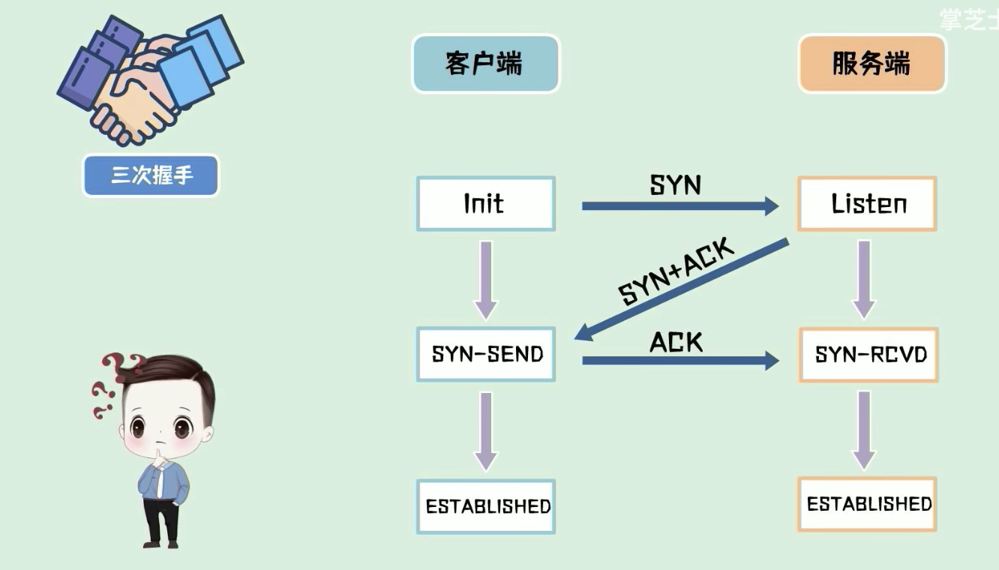
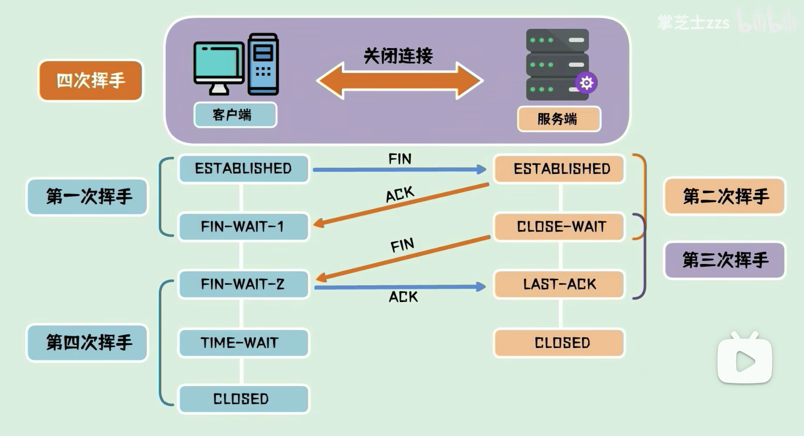

# TCP与UDP

## 1. 介绍
- TCP/UDP 都是工作在**传输层**，解决数据如何在网络中传输。HTTP 是应用层协议，主要解决如何包装数据，是建立在tcp协议之上的应用。
- TCP 是**可靠**的基于**连接**的
- UDP 是**不可靠**的基于**非连接**的

## 2. TCP
### 2.1 三次握手
- 1. 客户端发送SYN
- 2. 服务端发送SYN+ACK
- 3. 客户端发送ACK

### 2.2 为什么需要三次
- 为了解决网络不可靠的问题
- 如果只有两次：客户端发送SYN1，但是由于网络阻塞没有传输到服务端。于是，客户端又发送了SYN2，服务端收到了，建立了连接。这时，如果网络又通了，SYN1传到了服务端，又会建立一个连接。

### 2.3 丢包问题和乱序问题
- TCP 报文的组成：序列号+长度+数据内容
- 1. 发送端发送报文给接收端后，接收端返回 ACK(序列号+长度，也就是下一包需要发送的起始序列)，发送端再继续发送。
- 2. 发送端也可以发送连续的多包数据，接收端返回一次 ACK 就可以了。
- 3. 如果缺失了一部分报文，接收端可以发送 ACK 给发送端，然后重传。

### 2.4 四次挥手

### 2.5 为什么客户端需要超时等待
- 如果客户端发送的 ACK 包没有发送到服务端，那服务端会一直停留在最后确认状态。

### 2.6 为什么要四次挥手
- 第二次挥手和第三次挥手之间，服务端可能还会发送数据。

## 3. UDP
- UDP 发送数据就是简单的把数据封装一下发出去。
- UDP 的性能损耗小，资源占用少，稳定性弱。

## 4. 应用场景
- TCP：传输文件、发送邮件、浏览网页
- UDP：通话、直播
