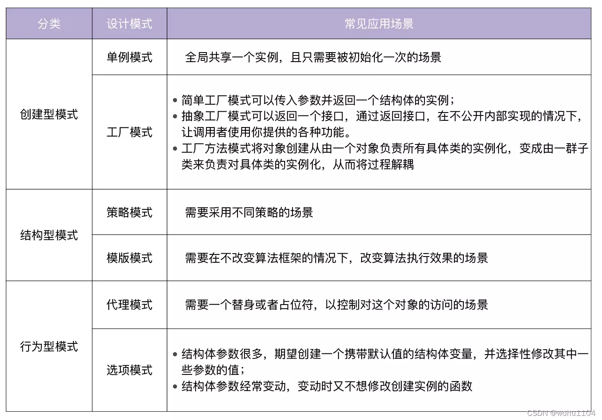

# 设计模式

## 1. 创建型模式
### 1.1 单例模式
一个类只创建一个实例，这种方式叫单例模式。单例模式分为饿汉模式和懒汉模式，饿汉模式是在程序启动时创建实例，懒汉模式是在第一次使用时创建实例，懒汉模式并发不安全，推荐使用饿汉模式。
- 饿汉模式 + sync.Once
```go
type singleton struct {
}

var instance *singleton
var once sync.Once

func GetInstance() *singleton {
    once.Do(func() {
        instance = &singleton{}
    })
    return instance
}
```

### 1.2 工厂模式
#### 1.2.1 简单工厂模式
给类一个 New 函数来创建类，可以确保创建的实例具有需要的参数

#### 1.2.2 抽象工厂模式
它和简单工厂模式的唯一区别就是，它返回的是接口  
它可以通过接口返回内部类

## 2. 结构型模式
### 2.1 策略模式
在项目开发中，我们经常要根据不同的场景，采取不同的措施，也就是不同的策略。
```go
// 定义一个策略类
type IStrategy interface {
  do(int, int) int
}

// 策略实现：加
type add struct{}

func (*add) do(a, b int) int {
  return a + b
}

// 策略实现：减
type reduce struct{}

func (*reduce) do(a, b int) int {
  return a - b
}

// 具体策略的执行者
type Operator struct {
  strategy IStrategy
}

// 设置策略
func (operator *Operator) setStrategy(strategy IStrategy) {
  operator.strategy = strategy
}

// 调用策略中的方法
func (operator *Operator) calculate(a, b int) int {
  return operator.strategy.do(a, b)
}
```
执行
```go
func TestStrategy(t *testing.T) {
  operator := Operator{}

  operator.setStrategy(&add{})
  result := operator.calculate(1, 2)
  fmt.Println("add:", result)

  operator.setStrategy(&reduce{})
  result = operator.calculate(2, 1)
  fmt.Println("reduce:", result)
}
```

### 2.2 模版模式
模板模式就是将一个类中能够公共使用的方法放置在抽象类中实现，将不能公共使用的方法作为抽象方法，强制子类去实现，这样就做到了将一个类作为一个模板，让开发者去填充需要填充的地方。
```go
// 社畜接口
type CompanySlave interface {
	GoToWork()
	AtWork()
	GoOffWork()
}

type Programmer struct {

}

func (Programmer) GoToWork() {
	fmt.Println("地铁上班")
}

func (Programmer) AtWork() {
	// 交给具体子类实现
}

func (Programmer) GoOffWork() {
	fmt.Println("地铁下班")
}

func work(cs CompanySlave) {
	cs.GoToWork()
	cs.AtWork()
	cs.GoOffWork()
}

type XiaoMing struct {
	Programmer
}

type XiaoHong struct {
	Programmer
}

func (* XiaoMing) AtWork() {
	fmt.Println("干到头秃")
}

func (* XiaoHong) AtWork() {
	fmt.Println("偷偷摸鱼")
}
```
执行
```go
func TestTemplate(t *testing.T) {
	fmt.Println("小红的一天")
	xiaohong := &XiaoHong{}
	work(xiaohong)

	fmt.Println("小明的一天")
	xiaoming := &XiaoMing{}
	work(xiaoming)
}
```

## 3. 行为型模式
### 3.1 代理模式
```go
type Seller interface {
    sell(name string)
}

// 火车站
type Station struct {
    stock int //库存
}

func (station *Station) sell(name string) {
    if station.stock > 0 {
        station.stock--
        fmt.Printf("%s买了一张票\n", name)
    } else {
        fmt.Println("票已售空")
    }
}

// 火车代理点
type StationProxy struct {
    station *Station // 持有一个火车站对象
}

func (proxy *StationProxy) sell(name string) {
    // 执行任务前的操作

    // 执行任务
    proxy.station.sell(name)

    // 执行任务后的操作
}
```

### 3.2 选项模式
可以选择使用默认值创建实例
```go
const (
    defaultAddr = "127.0.0.1"
    defaultPort = 8000
)

type Server struct {
    Addr string
    Port int
}

type ServerOptions struct {
    Addr string
    Port int
}

type ServerOption interface {
    apply(*ServerOptions)
}

type FuncServerOption struct {
    f func(*ServerOptions)
}

func (fo FuncServerOption) apply(option *ServerOptions) {
    fo.f(option)
}

func WithAddr(addr string) ServerOption {
    return FuncServerOption{
        f: func(options *ServerOptions) {
            options.Addr = addr
        },
    }
}

func WithPort(port int) ServerOption {
    return FuncServerOption{
        f: func(options *ServerOptions) {
            options.Port = port
        },
    }
}

func NewServer(opts ...ServerOption) *Server {
    options := ServerOptions{
        Addr: defaultAddr,
        Port: defaultPort,
    }

    for _, opt := range opts {
        opt.apply(&options)
    }

    return &Server{
        Addr: options.Addr,
        Port: options.Port,
    }
}

func main() {
    s1 := NewServer()
    s2 := NewServer(WithAddr("localhost"), WithPort(8001))
    s3 := NewServer(WithPort(8001))
    fmt.Println(s1)  // &{127.0.0.1 8000}
    fmt.Println(s2)  // &{localhost 8001}
    fmt.Println(s3)  // &{127.0.0.1 8001}
}
```

## 4. 总结

