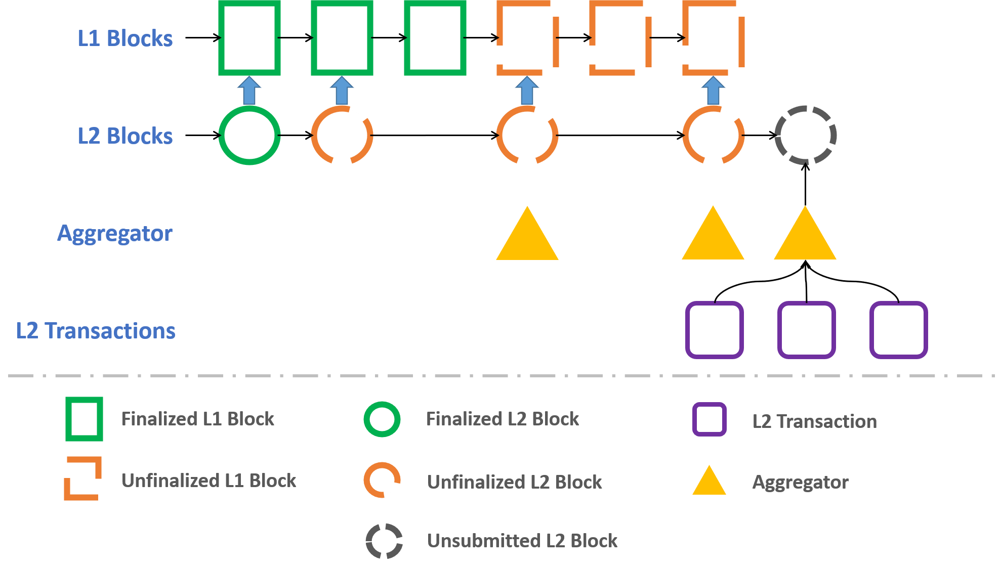

# Nervos layer2——Godwoken

## 1. 简介

- 目前 ckb 的 layer2 还只实现了 PoA 的 optimistic rollup，将来会实现 PoS 的 optimistic rollup，和 zk rollup。

## 2. 基本流程

1. 任何人都可以创建一个 rollup cell 来开启一个 layer2，此 layer2 有 256byte 的存储空间。

	> rollup cell 中会包含此 layer2 部署的相关信息。  
	> 存储空间由 Sparse Merkle Tree 构成，SMT 的 root hash 也会保存在 rollup cell 中。
