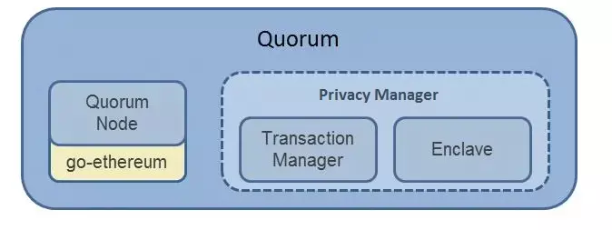
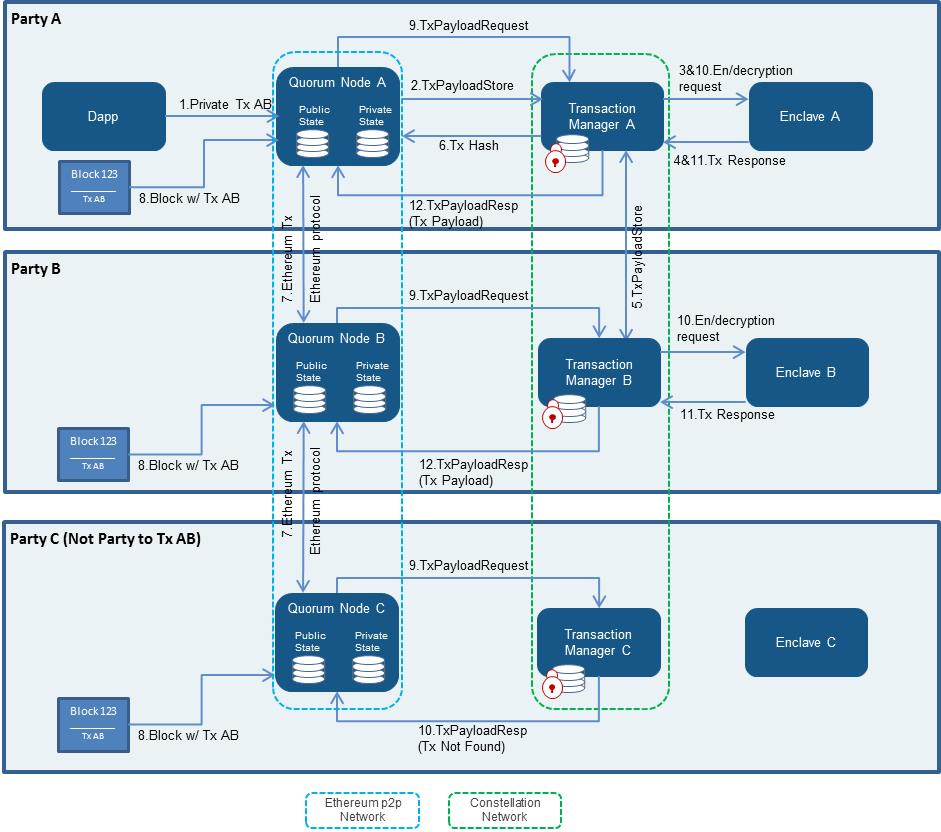
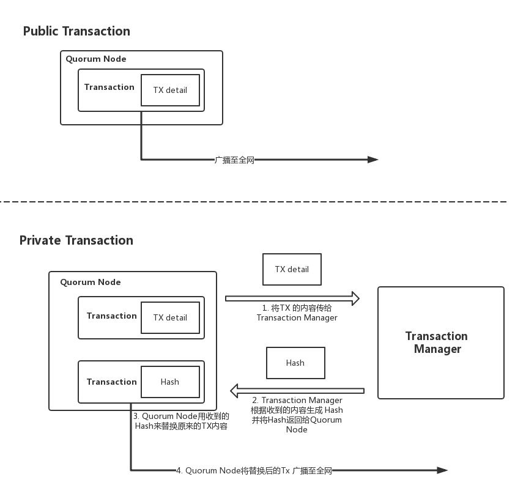

# Quorum

## 1. 说明

- Quorum 是 ConsenSys 和摩根大通合作开发的一种企业以太坊，基于公链以太坊的代码。我们公司投资过 ConsenSys，目前是合作关系，由我们帮助其开拓 Quorum 的中国市场。

- Quorum 相比公链以太坊增强了隐私控制、权限控制、共识机制，以及提高整个链的交易性能。不过 Quorum 的 tps 我还没有找到一个准确的说法，但是它是个联盟链，应该也不会太低。

- 此文档大多为 2018 年的资料整理而来。

## 2. 逻辑架构

- Quorum 的主要组件：

	- Quorum Node (节点)
	- Privacy Manager - Transaction Manager：用于`管理和传递私有消息`。
	- Constellation - Enclave：用来`对私有消息加解密`。

## 3. 交易过程

- Transaction Manager
	- Transaction Manager 会存储私有交易的内容，并且会将这条私有交易内容与其他`相关的` Transaction Manager 进行交互。同时它也会利用 Enclave 来加密或解密其收到的私有交易。

- Enclave
	- Enclave 和 Transaction Manager 是一对一的关系。

- Quorum 的交易有两种：公开交易和私有交易，实际上是在以太坊交易的基础上添加了 privacyMetadata 字段来识别交易类别。

- 隐私交易的 Transaction payload 是一个 hash 值，这个 hash 值是由 Transaction Manager 提供，链上的节点只能看到 hash 值，看不到交易内容。当你是交易的相关人员时，就可以通过 Transaction Manager 和 Enclave 来获得这笔交易的正确内容。

## 4. 共识过程
- 在共识方法上, Quorum 用 QuorumChain 取代了以太坊的 POW, 最新推出的 2.0.0 又增加了 Raft 的共识方法。
- QuorumChain 是基于投票机制的共识方式，在原来无限制的 P2P 传输方式上增加了权限功能，使得 P2P 传输只能在互相允许的节点间传输。
- Quorum 修改了校验区块的方式，使其能支持隐私交易。
