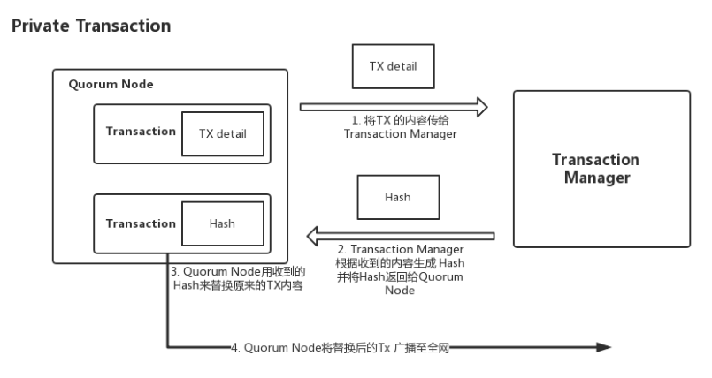

# Quorum

## 1. 说明

- Quorum 是 ConsenSys 和摩根大通合作开发的一种企业以太坊，基于公链以太坊的代码。我们公司投资过 ConsenSys，目前是合作关系，由我们帮助其开拓 Quorum 的中国市场。

- Quorum 相比公链以太坊增强了隐私控制（`隐私交易/合约`）、权限控制、共识机制，以及提高整个链的交易性能。不过 Quorum 的 tps 我还没有找到一个准确的说法，但是它是个联盟链，应该也不会太低。

## 2. 逻辑架构

- Quorum 的主要组件：

	- Quorum Node
	- Privacy Manager：有 Constellation 和 Tessera 两种，现在 Constellation 停止更新了，最好使用 Tessera。Privacy Manager 可以想象成分布式的密钥服务器。
		- Transaction Manager：用于`管理和传递私有消息`，它和公开交易没有瓜葛。
		- Enclave：用来`对私有消息加解密`。

## 3. 交易

- Quorum 的交易有两种：公开交易和私有交易，实际上是添加了 privacyMetadata 字段来识别交易类别。

- 隐私交易的 Transaction payload 是一个 hash 值，这个 hash 值是由 Transaction Manager 提供，链上的节点只能看到 hash 值，看不到交易内容。当你是交易的相关人员时，就可以通过 Transaction Manager 和 Enclave 来获得这笔交易的正确内容。

- 这是一个私有交易的详细流程，其中 Transaction AB 跟 party A 和 party B 相关，与 party C 无关。Party 可以看作是一个人或者一个组织。

- Transaction Manager
	- Transaction Manager 会存储私有交易的内容，并且会将这条私有交易内容与其他`相关的` Transaction Manager 进行交互。同时它也会利用 Enclave 来加密或解密其收到的私有交易。

- Enclave
	- Enclave 和 Transaction Manager 是一对一的关系。

## 4. 共识

- 在共识方法上, Quorum 用 QuorumChain 取代了以太坊的 POW, 最新推出的 2.0.0 使用了基于 Raft 的共识方法取代了 QuorumChain。
- 相比 QuorumChain，Raft-based 不会产生空的区块，tps 更高。
- Quorum 还提供了 Istanbul BFT（IBFT） 和 Clique POA。

- [raft 算法简介](https://www.jianshu.com/p/8e4bbe7e276c)，最后有个演示的动画链接。

